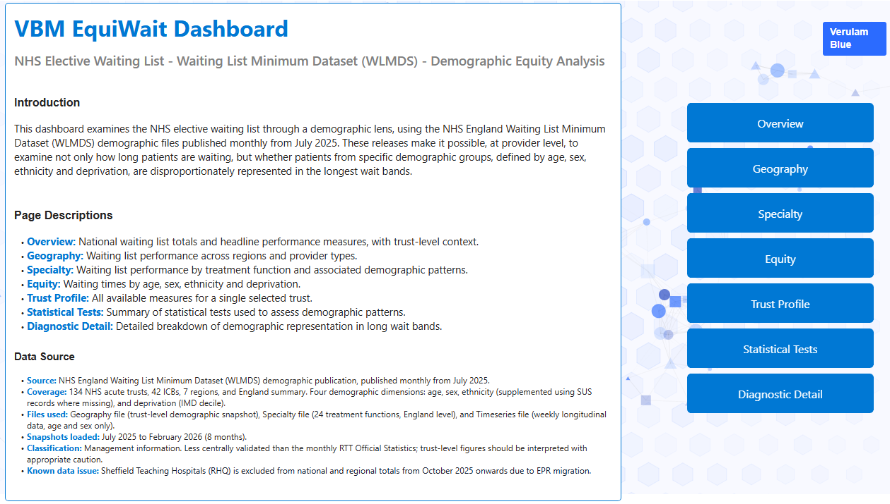
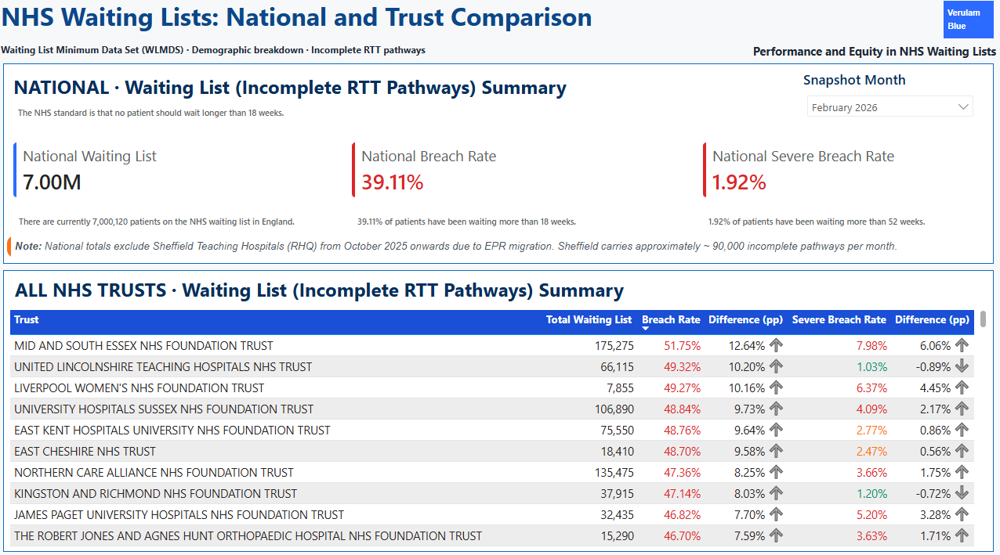
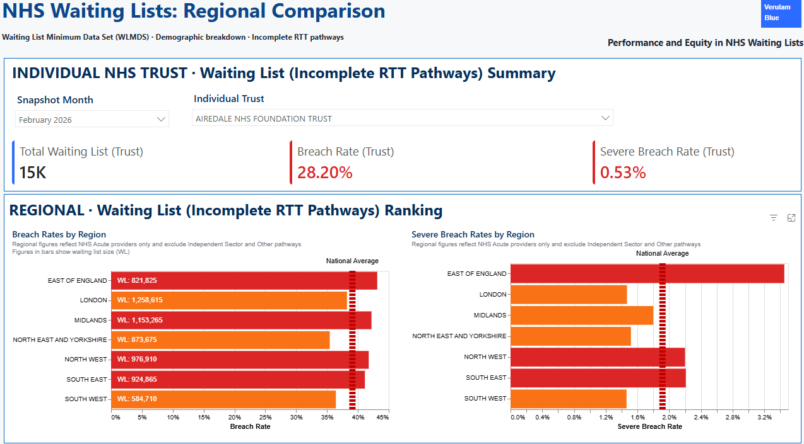
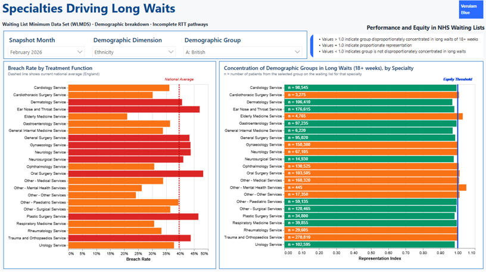
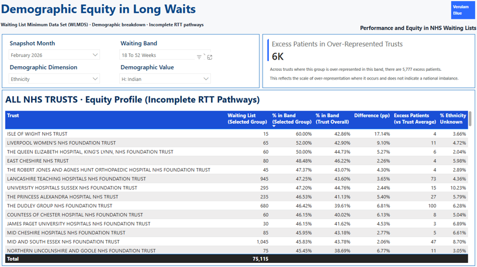
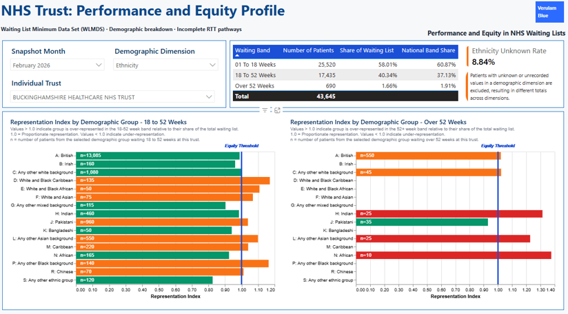
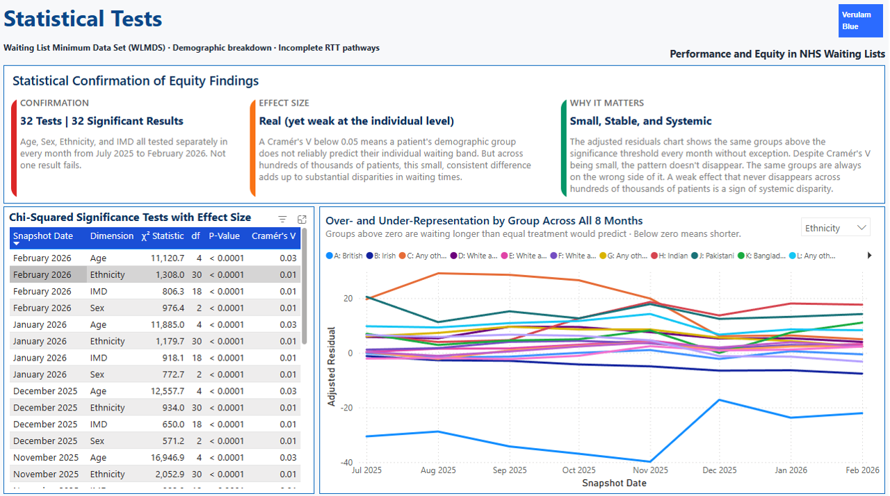
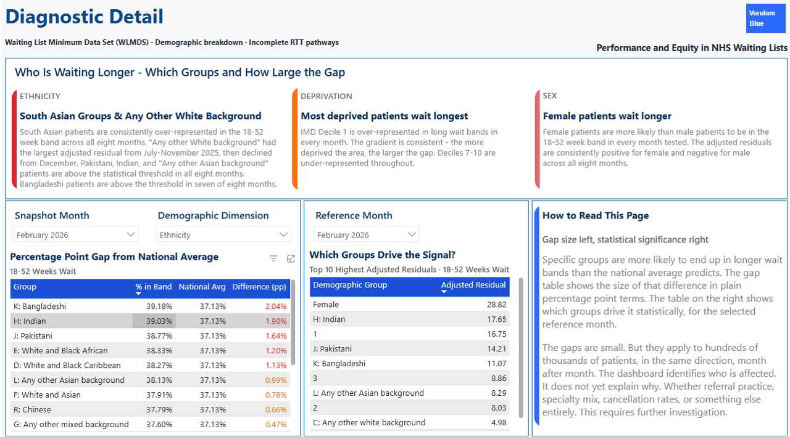
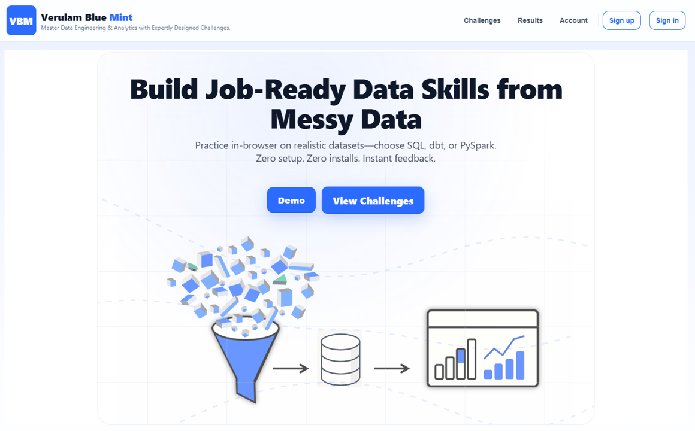

# VBM EquiWait: Demographic Equity in NHS Waiting Lists
## *End-to-end data platform (Fabric → dbt → Power BI)*

    

> **A note on this analysis:** This is a data and analytics engineering project built on publicly available NHS England data from the Waiting List Minimum Dataset (WLMDS) demographic publication. All findings are descriptive. They identify patterns in administrative data and note where those patterns are consistent or pronounced. They do not establish causes, assign responsibility, or support conclusions about why any particular pattern exists. Figures are management information, not official statistics, and should be interpreted with appropriate caution.

---

## Dashboard Preview

**[-> View the live dashboard on Verulam Blue](http://equiwait.verulamblue.com/)**

<table>
  <tr>
    <td width="25%">
      <a href="./assets/dashboard_pages/page_01_home.png">
        
      </a>
      <p align="center"><sub>01 - Home</sub></p>
    </td>
    <td width="25%">
      <a href="./assets/dashboard_pages/page_02_overview.png">
        
      </a>
      <p align="center"><sub>02 - Overview</sub></p>
    </td>
    <td width="25%">
      <a href="./assets/dashboard_pages/page_03_geography.png">
        
      </a>
      <p align="center"><sub>03 - Geography</sub></p>
    </td>
    <td width="25%">
      <a href="./assets/dashboard_pages/page_04_specialty.png">
        
      </a>
      <p align="center"><sub>04 - Specialty</sub></p>
    </td>
  </tr>
  <tr>
    <td width="25%">
      <a href="./assets/dashboard_pages/page_05_equity.png">
        
      </a>
      <p align="center"><sub>05 - Equity</sub></p>
    </td>
    <td width="25%">
      <a href="./assets/dashboard_pages/page_06_trust_profile.png">
        
      </a>
      <p align="center"><sub>06 - Trust Profile</sub></p>
    </td>
    <td width="25%">
      <a href="./assets/dashboard_pages/page_07_statistical_tests.png">
        
      </a>
      <p align="center"><sub>07 - Statistical Tests</sub></p>
    </td>
    <td width="25%">
      <a href="./assets/dashboard_pages/page_08_diagnostic.png">
        
      </a>
      <p align="center"><sub>08 - Diagnostic Detail</sub></p>
    </td>
  </tr>
</table>

---

## 1) Background

In July 2025, NHS England began publishing a demographic breakdown of the NHS elective waiting list at trust level, updated monthly. For the first time, this made it possible to see how many patients were waiting, together with who they were: age, sex, ethnicity, and deprivation, and whether some groups were more likely to experience longer waits.

This dataset, part of the Waiting List Minimum Dataset (WLMDS), was introduced to help NHS teams identify and address variation in waiting times across different demographic groups. This project brings together the available monthly publications from NHS England covering July 2025 to February 2026 into a single dataset.

The project builds an end-to-end analytical pipeline in Microsoft Fabric. Each month's data is collected, validated, and stored. dbt models transform the raw files into a star schema, with trust, ICB, and region relationships built into the geography dimension. A Power BI report brings this together to support commissioners, trust boards, and analysts in assessing both performance and equity.

The WLMDS demographic release consists of three CSV files each month. Combining eight months of data creates a longitudinal view of how the demographic profile of the waiting list has changed over time.

---

## 2) Deliverables

### Published tables (dbt mart layer)

All mart tables are deployed to the `marts` schema in `VBM_EquiWait_WH`. Intermediate models land in the `intermediate` schema. Source files are loaded into the `landing` schema via Fabric Get Data before dbt runs.

| Schema | Table | Description |
|---|---|---|
| `marts` | `dim_demographic` | Demographic category dimension: age band, sex, ethnicity category, IMD decile |
| `marts` | `dim_geography` | Provider dimension with ODS hierarchy: trust, ICB, region, England. SCD Type-2 tracked. |
| `marts` | `dim_specialty` | RTT treatment function dimension (24 specialties) |
| `marts` | `dim_waiting_band` | Waiting band reference: seeded from `dim_waiting_band.csv` |
| `marts` | `fact_waiting_list_geography` | Monthly incomplete pathway counts by provider, demographic group and waiting band |
| `marts` | `fact_waiting_list_specialty` | Monthly incomplete pathway counts by specialty, demographic group and waiting band (England level) |
| `marts` | `fact_waiting_list_timeseries` | Weekly England-level incomplete pathway counts by age and sex from September 2021 |
| `landing` | `wlmds_geography_landing` | Raw Geography CSV data as loaded from NHS England source files |
| `landing` | `wlmds_specialty_landing` | Raw Specialty CSV data as loaded from NHS England source files |
| `landing` | `wlmds_timeseries_landing` | Raw Timeseries CSV data as loaded from NHS England source files |

### Date dimension (Power BI semantic model)

`dim_date` is created as a DAX calculated table directly inside the semantic model. It is not sourced from the warehouse. 

```dax
dim_date =
ADDCOLUMNS(
    CALENDAR( DATE( 2021, 1, 1 ), DATE( 2030, 12, 31 ) ),
    "month_number",     MONTH( [Date] ),
    "month_name",       FORMAT( [Date], "MMMM" ),
    "month_short",      FORMAT( [Date], "MMM" ),
    "year",             YEAR( [Date] ),
    "year_month",       FORMAT( [Date], "YYYY-MM" ),
    "financial_year",
        IF(
            MONTH( [Date] ) >= 4,
            "FY" & YEAR( [Date] ) & "/" & RIGHT( YEAR( [Date] ) + 1, 2 ),
            "FY" & ( YEAR( [Date] ) - 1 ) & "/" & RIGHT( YEAR( [Date] ), 2 )
        ),
    "financial_month",
        IF( MONTH( [Date] ) >= 4, MONTH( [Date] ) - 3, MONTH( [Date] ) + 9 ),
    "is_week_ending_sunday",
        IF( WEEKDAY( [Date], 2 ) = 7, TRUE, FALSE )
)
```

The table spans 2021-01-01 to 2030-12-31, covering the full WLMDS timeseries history from September 2021 and providing headroom for future releases. Financial year columns follow the NHS April-to-March convention.

### Dashboard (Power BI)

- **Home:** Project overview, data source, page navigation
- **Overview:** National waiting list headline figures and trust-level performance for a selected trust
- **Geography:** Waiting list performance across regions, ICBs and provider types
- **Specialty:** Which treatment functions carry the highest breach burden and the demographic groups most concentrated within them
- **Equity:** Whether age, sex, ethnicity and deprivation are associated with which waiting band a patient falls into
- **Trust Profile:** All dimensions for a single selected trust in one place
- **Statistical Tests:** Chi-square tests and Cramér's V effect sizes across all four demographic dimensions and all eight monthly snapshots
- **Diagnostic Detail:** Demographic representation index - which groups are over or under-represented in long wait bands, and by how much

### Documentation

- [`docs/data_dictionary.md`](./docs/data_dictionary.md) - full column-level definitions for all mart tables
- [`docs/physical_data_model.md`](./docs/physical_data_model.md) - schema design, grain statements, and relationship definitions
- [`docs/er_diagram.mermaid`](./docs/er_diagram.mermaid) - entity-relationship diagram for the star schema
- [`docs/analytical_report.md`](./docs/analytical_report.md) - full analytical report covering performance, geography, specialty and equity findings

---

## 3) Repository Structure

```
VBM_EquiWait/
├── source_data/
│   ├── 2025-07/
│   │   ├── WLMDS-Demographics-Geography-to-27-July-2025-v1.csv
│   │   ├── WLMDS-Demographics-Specialty-to-27-July-2025-v1.csv
│   │   └── WLMDS-Demographics-Timeseries-to-27-July-2025-v1.csv
│   ├── 2025-08/
│   ├── 2025-09/
│   ├── 2025-10/
│   ├── 2025-11/
│   ├── 2025-12/
│   ├── 2026-01/
│   └── 2026-02/
│       ├── WLMDS-Demographics-Geography-to-22-February-2026-v1.csv
│       ├── WLMDS-Demographics-Specialty-to-22-February-2026-v1.csv
│       └── WLMDS-Demographics-Timeseries-to-22-February-2026-v1.csv
│                      
├── fabric_workspace/
│   └── VBM_EquiWait_dbt_Job.DataBuildToolJob/
│       └── Code/
│           └── dbt/
│               ├── dbt_project.yml
│               ├── packages.yml
│               ├── analyses/
│               │   └── geography_timeseries_reconciliation.sql
│               ├── seeds/
│               │   ├── dim_waiting_band.csv
│               │   ├── trust_name_canonical.csv
│               │   └── seed_mappings_schema.yml
│               └── models/
│                   ├── staging/
│                   │   ├── _sources.yml
│                   │   ├── _stg_deduped_schema.yml
│                   │   ├── stg_geography__deduped.sql
│                   │   ├── stg_specialty__deduped.sql
│                   │   └── stg_timeseries__deduped.sql
│                   ├── intermediate/
│                   │   ├── _int_schema.yml
│                   │   ├── int_geography.sql
│                   │   ├── int_specialty.sql
│                   │   └── int_timeseries.sql
│                   └── marts/
│                       ├── _dim_schema.yml
│                       ├── dim_demographic.sql
│                       ├── dim_geography.sql
│                       ├── dim_specialty.sql
│                       ├── fact_waiting_list_geography.sql
│                       ├── fact_waiting_list_specialty.sql
│                       └── fact_waiting_list_timeseries.sql
│    
└── docs/
    ├── data_dictionary.md
    ├── physical_data_model.md
    ├── er_diagram.mermaid
    ├── analytical_report.md
    └── data_retrieval.md
```

---

## 4) Key Findings at a Glance

| Finding | Headline Result |
|---|---|
| **Deprivation gradient** | IMD Decile 1 (most deprived) is over-represented in long wait bands in every month across the window. The gradient runs in the same direction across all deprivation deciles without exception. |
| **Ethnicity pattern** | Indian, Pakistani and Bangladeshi patients are over-represented in the 18-52 week band in every monthly snapshot. The pattern is not explained by concentration in the highest-breach specialties. |
| **Regional gap** | East of England has the highest breach rate and severe breach rate of any region in every month. If it performed at the national average, approximately 32,000-40,000 fewer patients would be in breach at any snapshot. |
| **Trust-level variation** | Mid and South Essex carries a breach rate of 50-52% throughout - 10-13 percentage points above the national average. With approximately 175,000 patients and a severe breach rate around 8%, approximately 14,000 patients have been waiting more than a year. |
| **Specialty as the largest source of variation** | A gap of approximately 30 percentage points separates Ear Nose and Throat (~48% breach rate) from Elderly Medicine (~17%). This is larger than regional or demographic variation and stable across all eight months. |
| **National position** | The 18-week breach rate moves within a narrow band (39.1%-40.0%) across the window. The severe breach rate falls from 2.79% to 1.92% - approximately 61,000 fewer patients waiting more than a year by February compared to July. |
| **Statistical confirmation** | 32 chi-square tests (4 dimensions × 8 months) all return adjusted p-values below 0.0001 after Benjamini-Hochberg correction. All Cramér's V values are below 0.04 - patterns are confirmed non-random but small at the individual level. |
| **Dermatology signal** | Dermatology shows a representation index above 1.0 for the selected ethnic group in every month, in a specialty with a near-average breach rate - the most stable and specific equity signal in the specialty data. |

---

## 5) Data Source & Coverage

### 5.1 Source dataset

| Source | Description | Snapshot |
|---|---|---|
| NHS England WLMDS Demographic Publication | Monthly CSV release covering incomplete RTT pathways by demographic group, waiting band, provider and specialty | July 2025 - February 2026 (8 monthly releases) |

The WLMDS demographic publication consists of three files released monthly by NHS England:

| File | Geography | Time Coverage |
|---|---|---|
| Geography | England, 7 regions, 42 ICBs, 134 NHS acute trusts (183 organisations) | Monthly snapshot - most recent week only |
| Specialty | England level only | Monthly snapshot - most recent week only |
| Timeseries | England level only | Weekly from September 2021 to present |

### 5.2 Data access

NHS England does not maintain a public archive of previous WLMDS demographic releases on the publication page. The complete published history was retrieved by reconstructing the URL pattern used for each monthly release on the NHS England server. The full backrun from July 2025 to February 2026 is accessible at the original URLs even though it is not linked from the main publication page.

The source CSV files are not redistributed in this repository. Users wishing to replicate the pipeline should retrieve them from NHS England directly using the URL pattern documented in [`docs/data_retrieval.md`](./docs/data_retrieval.md).

### 5.3 Coverage

- **Organisations:** 1 England summary, 7 NHS England regions, 42 Integrated Care Boards, 134 NHS acute trusts
- **Demographic dimensions:** Age (5 bands), sex (3 categories), ethnicity (31 categories, augmented via SUS where WLMDS submission is missing), deprivation (IMD decile, 10 categories)
- **Waiting bands:** Under 18 weeks, 18-52 weeks, 52+ weeks, unknown clock start, total
- **Snapshots assembled:** 24 CSV files - 8 Geography, 8 Specialty, 8 Timeseries
- **Excluded:** Sheffield Teaching Hospitals (~90,000 pathways) excluded from national and regional totals from October 2025 onwards due to EPR migration

### 5.4 Data quality notes

| Issue | Detail |
|---|---|
| Management information status | WLMDS is subject to less central validation than the monthly RTT official statistics. Trust-level figures should be interpreted with appropriate caution. |
| Demographic exclusion gap | Patients with unknown demographic information are excluded from the relevant breakdown but remain in the overall total. Demographic percentages are calculated on a sub-population whose completeness varies by trust and dimension. |
| Ethnicity augmentation | Where ethnicity is not recorded in the WLMDS submission, the SUS ethnicity record is used. The degree of augmentation varies by trust and is not published. |
| Suppression threshold | Count values below the disclosure threshold are shown as * rather than a figure. Small demographic groups at small trusts may be systematically suppressed. |
| Count rounding | All count values are rounded to the nearest 5. |
| Snapshot additivity | Geography and Specialty files are monthly snapshots of open-pathway counts. They cannot be summed across time periods. |

---

## 6) Data Pipeline & Processing Approach

The pipeline runs across four stages from raw source ingestion through to the executive dashboard.

**Stage 1: Data Retrieval and Ingestion**
Monthly WLMDS demographic CSV files retrieved from NHS England and loaded into the `landing` schema of `VBM_EquiWait_WH` via Fabric Get Data. Three landing tables are maintained: `wlmds_geography_landing`, `wlmds_specialty_landing`, and `wlmds_timeseries_landing`. Schema validation and volume checks run on ingestion before dbt proceeds.

**Stage 2: Staging and Intermediate Layer (dbt)**
Raw CSV files cleaned and parsed through dbt models. The staging layer (`stg_geography__deduped`, `stg_specialty__deduped`, `stg_timeseries__deduped`) handles deduplication and initial type casting. The intermediate layer (`int_geography`, `int_specialty`, `int_timeseries`) deploys to the `intermediate` schema and handles:
- Parsing of demographic dimensions from combined category fields
- Separation of detail rows from pre-computed total rows (flagged explicitly to prevent double-counting)
- Suppressed value handling (cells shown as * are flagged and excluded from percentage calculations)
- Waiting band standardisation using the `dim_waiting_band` seed
- Trust name canonicalisation using the `trust_name_canonical` seed

**Stage 3: Star Schema Mart Layer (dbt)**
Seven dbt models deployed to the `marts` schema of `VBM_EquiWait_WH` covering all dimensions and fact tables. Surrogate keys generated using `dbt_utils.generate_surrogate_key()`. SCD Type-2 tracking on `dim_geography` ensures organisational restructures do not silently rewrite historical relationships. `dim_waiting_band` is seeded from a CSV rather than derived from source data, providing a stable reference for waiting band categorisation. `dim_date` is the one dimension not deployed via dbt, it is created as a DAX calculated table directly inside the Power BI semantic model (see Section 2).

**Stage 4: Semantic Model and Dashboard (Power BI)**
Power BI semantic model connects to the mart via Import mode through the Fabric Warehouse SQL analytics endpoint. All percentage calculations enforce a consistent denominator. The representation index, measuring whether a demographic group is over or under-represented in the long wait band relative to their share of the waiting list, is computed per specialty, per snapshot month.

### 6.1 Key modelling decisions

**Pre-computed total row separation** - Each WLMDS file contains pre-computed total rows across waiting bands, demographic categories, and geography hierarchy levels. Summing across these rows without filtering produces double-counting. The intermediate layer flags all total rows and enforces selection of either detail rows or pre-computed totals - never both - in every downstream model and DAX measure.

**Snapshot additivity enforcement** - Geography and Specialty files are open-pathway snapshots, not flow data. They cannot be summed across time periods. This constraint is enforced at the semantic model layer and documented on every time-series visual.

**Denominator consistency** - All percentage calculations use the demographic sub-total as the denominator, not the overall total. The exclusion gap (patients with unknown demographics excluded from breakdowns but retained in totals) is surfaced explicitly in the report for every trust and dimension.

**Geography hierarchy** - Trust-level figures do not sum to ICB totals, and ICB figures do not sum to regional totals, because the published files include independent rows for each level. Analysis at each level uses only the rows for that level; cross-level aggregation is not performed.

### 6.2 Reconciliation analysis

`analyses/geography_timeseries_reconciliation.sql` compares England-level age and sex counts between the Geography file and the Timeseries file for each snapshot month. Both files should produce the same counts for England at the most recent week of each month, any divergence indicates a data quality issue in the source files or a processing discrepancy between the two pipelines.

The query takes the most recent week per month from the Timeseries file using `ROW_NUMBER()` partitioned by month, then joins it against the England-level Geography counts for the same month, metric, category, and waiting band. Results are ordered by absolute divergence so the largest gaps surface first.

This file sits in the `analyses/` folder of the dbt project, not in `tests/`. The `analyses/` folder is the correct location for dbt SQL that produces output for human review rather than a pass/fail result.

```sql
-- core reconciliation logic (abbreviated)
with geography_england as (
    select snapshot_month, metric, category, waiting_bands,
           sum(try_cast(count as int)) as geography_count
    from [VBM_EquiWait_WH].[dbt_dev_intermediate].[int_geography]
    where code = 'ENG' and geography = 'ENGLAND'
      and metric in ('Age', 'Sex') and waiting_bands <> 'Total'
    group by snapshot_month, metric, category, waiting_bands
),
timeseries_monthly as (
    select snapshot_month, metric, category, waiting_bands,
           patient_count as timeseries_count
    from (
        select format(week_ending_date, 'yyyy-MM') as snapshot_month,
               metric, category, waiting_bands,
               try_cast(count as int) as patient_count,
               row_number() over (
                   partition by format(week_ending_date, 'yyyy-MM'),
                                metric, category, waiting_bands
                   order by week_ending_date desc
               ) as rn
        from [VBM_EquiWait_WH].[dbt_dev_intermediate].[int_timeseries]
        where metric in ('Age', 'Sex')
    ) t
    where rn = 1
)
select g.snapshot_month, g.metric, g.category, g.waiting_bands,
       g.geography_count, t.timeseries_count,
       g.geography_count - t.timeseries_count as divergence,
       abs(g.geography_count - t.timeseries_count) as abs_divergence
from geography_england g
inner join timeseries_monthly t
    on  g.snapshot_month = t.snapshot_month
    and g.metric         = t.metric
    and g.category       = t.category
    and g.waiting_bands  = t.waiting_bands
order by abs_divergence desc;
```

---

## 7) Data Quality & Testing

dbt tests cover all mart models and must pass before dashboard validation.

- **Primary key uniqueness** on all dimension and fact tables
- **Not-null constraints** on all foreign keys
- **Accepted values tests** for waiting band, demographic dimension, and geography level fields
- **Referential integrity** between all fact and dimension tables
- **Suppression audit** - custom analysis confirming suppressed cell rates by trust and dimension

```bash
dbt test
```

All tests must return zero failures before proceeding to Power BI validation. All baseline dashboard metrics are independently reconciled against the mart layer via direct SQL.

---

## 8) Star Schema - Model Reference

```
dim_geography  (SCD Type-2, ODS hierarchy: trust -> ICB -> region -> England)
  └── fact_waiting_list_geography   [geography_key, demographic_key, waiting_band_key, snapshot_month]

dim_specialty
  └── fact_waiting_list_specialty   [specialty_key, demographic_key, waiting_band_key, snapshot_month]

dim_demographic
  (covers: age band | sex | ethnicity | imd_decile)

dim_waiting_band
  (seeded from dim_waiting_band.csv)

dim_date  (DAX calculated table, defined in the Power BI semantic model, not the warehouse)
  (spans 2021-01-01 to 2030-12-31, NHS financial year convention)

fact_waiting_list_timeseries   [snapshot_date, demographic_key, waiting_band_key]
  (England level, age and sex only, weekly from September 2021)
```

### Grain statements

| Model | Grain |
|---|---|
| `fact_waiting_list_geography` | One row per organisation per demographic category per waiting band per snapshot month |
| `fact_waiting_list_specialty` | One row per treatment function per demographic category per waiting band per snapshot month |
| `fact_waiting_list_timeseries` | One row per week per demographic category (age/sex only) per waiting band |

---

## 9) Statistical Framework

### Tests conducted

For each of the four demographic dimensions (age, sex, ethnicity, IMD) and each of the eight monthly snapshots, a chi-square test of independence was conducted with the null hypothesis that there is no association between the demographic dimension and waiting band at England level. This produced 32 tests in total (4 dimensions × 8 months). P-values were adjusted using the Benjamini-Hochberg procedure to control the false discovery rate across the family of 32 tests.

### Results summary

| Dimension | Cramér's V range | Degrees of freedom | All adjusted p-values |
|---|---|---|---|
| Age | 0.028-0.038 | 4 | < 0.0001 |
| Ethnicity | 0.009-0.013 | 30 | < 0.0001 |
| IMD | 0.005-0.009 | 18 | < 0.0001 |
| Sex | 0.007-0.012 | 2 | < 0.0001 |

### Interpretation

With N approximately 7 million patients, statistical significance is mathematically guaranteed even for trivially small associations. Cramér's V values below 0.10 are generally considered small - all values above are well below this threshold. The correct interpretation is that the patterns are confirmed non-random (not attributable to sampling variation), but the individual-level association between demographic characteristics and waiting band is negligible. The significance of the demographic findings lies in their consistency and directionality across the full window, not in the size of any individual month's effect.

> **The sample size problem:** With N = 7 million, a Cramér's V of 0.01 produces a chi-square in the hundreds. Presenting p-values alone would create a misleading impression of the strength of demographic associations. Effect sizes (Cramér's V) are the primary measure reported throughout.

### Representation index

The representation index measures whether a demographic group makes up a larger or smaller share of the long wait band (18+ weeks) than their share of the total waiting list for a given specialty. A value above 1.0 indicates over-representation; below 1.0 indicates under-representation; 1.0 indicates proportionate representation.

---

## 10) Key Analytical Findings

### Finding 1 - Deprivation: A Consistent Gradient Across the Window

In every monthly snapshot from July 2025 to February 2026, patients from IMD Decile 1 (most deprived) make up a larger share of the long wait band than their share of the total waiting list. Moving from Decile 1 to Decile 10, the degree of over-representation decreases at each step, in the same direction in every month. Cramér's V for IMD is 0.005-0.009, small at the individual level. The finding is noted for its directional consistency across the full window. Absolute differences between the most and least deprived groups are in the range of 0.3-1.2 percentage points.

---

### Finding 2 - Ethnicity: System-Wide Over-Representation for Specific Groups

Indian, Pakistani and Bangladeshi patients are over-represented in the 18-52 week band in every monthly snapshot across the full window. The pattern is consistent across all eight months. Cramér’s V (0.009-0.013) indicates a small effect at the individual level, but a stable direction of association. Taken together, this reflects a persistent health inequality, with unequal outcomes that translate into a meaningful absolute impact, affecting hundreds to thousands of patients in the longest waiting band.

---

### Finding 3 - Ethnicity: Specialty-Specific Over-Representation


For patients coded as “Any other Asian background”, over-representation in the 18-52 week band is consistently concentrated in Dermatology, Neurosurgery and General Internal Medicine-specialties with below or near-average breach rates. This pattern is not concentrated in Ear Nose and Throat, Oral Surgery or Plastic Surgery, which have the highest breach rates in the dataset.

Dermatology shows a representation index above 1.0 in every month, with patient counts of 3,025-3,730. Neurosurgery and General Internal Medicine are also consistently above 1.0 across all eight months.

The overall association is small (Cramér’s V 0.009-0.013) but stable in direction across all months and consistently present in the longest-waiting band. This reflects a structured pattern rather than random variation.

In practice, this indicates that a limited number of specialties are contributing disproportionately to longer waits for this group. The pattern is not driven by overall system performance, but is concentrated within specific clinical pathways.

---

### Finding 4 - Regional Geography: East of England vs North East and Yorkshire

East of England has the highest breach rate and severe breach rate of any region in every month. Its breach rate runs approximately 4-5 percentage points above the national average with a mid-sized waiting list (757,000-859,000). If East of England performed at the national average, approximately 32,000-40,000 fewer patients would be in breach at any snapshot.

North East and Yorkshire has the lowest breach rate of any region in every month, with a list of 870,000-994,000, comparable in size to East of England. 

---

### Finding 5 - Trust-Level Variation: Scale and Persistence

Mid and South Essex carries a breach rate of 50-52% across the window, 10-13 percentage points above the national average at every snapshot, with approximately 175,000 patients and a severe breach rate around 8% throughout.

| Month | Waiting List | Breach Rate | vs National (pp) | Severe Breach Rate |
|---|---|---|---|---|
| Jul 2025 | 171,965 | 50.39% | +10.51 | 7.75% |
| Aug 2025 | 174,720 | 49.95% | +9.99 | 8.15% |
| Sep 2025 | 176,715 | 50.02% | +10.01 | 8.53% |
| Oct 2025 | 179,405 | 50.29% | +11.00 | 8.75% |
| Nov 2025 | 178,750 | 51.18% | +12.05 | 8.27% |
| Dec 2025 | 177,565 | 52.49% | +12.66 | 8.19% |
| Jan 2026 | 175,290 | 52.56% | +12.67 | 8.57% |
| Feb 2026 | 175,275 | 51.75% | +12.64 | 7.98% |

United Lincolnshire Teaching Hospitals and University Hospitals Sussex appear in the top ten for breach rate in seven of eight months each. James Paget University Hospitals appears in all eight months with a list of approximately 32,000-35,000, a trust where the challenge is pathway or capacity specific rather than scale-related.

Liverpool Women's records a severe breach rate of 12.02% in December at approximately 8,000 patients, the highest concentration of very long waiters relative to list size visible in the data, while ranking only 8th on overall breach rate that month. The headline breach metric does not always surface the most acute pressure points.

---

### Finding 6 - Specialty: The Largest Source of Variation

Ear Nose and Throat has the highest breach rate of any specialty in every month (approximately 47-50%). Oral Surgery is second or joint-first. Plastic Surgery is third. Elderly Medicine sits at approximately 17% throughout. The gap between highest and lowest is approximately 30 percentage points, larger than regional variation and larger than any demographic effect. The ordering does not change across the eight-month window.

The specialty finding is directly relevant to the ethnicity finding: the ethnic group over-representation identified in Finding 3 is absent from the three highest-breach specialties, confirming it is not explained by these groups entering structurally pressured pathways.

---

### Finding 7 - National Position: Stable Access, Falling Extreme Waits

The 18-week breach rate moves within a band of 39.11%-40.00% across the window, no directional change. The severe breach rate falls from 2.79% in July to 1.92% in February, a reduction of 0.87 percentage points sustained from September onwards. At approximately 7 million patients, this corresponds to approximately 61,000 fewer patients waiting more than a year by February compared to July. The data records this change; it does not indicate what produced it.

---

## 11) Tech Stack

| Component | Detail |
|---|---|
| Platform | Microsoft Fabric (Lakehouse + Warehouse) |
| Transformation | dbt-fabric \| dbt core |
| Dialect | T-SQL |
| Surrogate keys | `dbt_utils.generate_surrogate_key()` |
| Geography dimension | SCD Type-2 tracking |
| Semantic model | Power BI Import mode via Fabric Warehouse SQL analytics endpoint |
| Dashboard | VBM_EquiWait_NHS_Waiting_List_Equity_Dashboard |
| HTML wrapper | VBM_EquiWait_Website_FINAL.html - deployed via Azure Static Web Apps |
| Hosting | Azure Static Web Apps + Cloudflare DNS → equiwait.verulamblue.com |
| Statistical analysis | Chi-square tests of independence, Cramér's V effect sizes, Benjamini-Hochberg correction |
| Validation | All baseline dashboard metrics reconciled via SQL against mart layer |
| Report generated | April 2026 |

---

## 12) Assumptions & Limitations

| Limitation | Detail |
|---|---|
| Management information status | WLMDS is subject to less central validation than monthly RTT official statistics. Trust-level figures should be interpreted with appropriate caution and validated against RTT totals where possible. |
| Demographic exclusion gap | Patients with unknown demographic information are excluded from the relevant breakdown but remain in the total. Demographic percentages are calculated on a sub-population whose completeness varies by trust and dimension. |
| Ethnicity augmentation | SUS ethnicity records are used where WLMDS submission is missing. Degree of augmentation varies by trust and is not published. Ethnicity findings are interpreted in terms of consistency and direction rather than precise magnitude. |
| No trust-level specialty intersection | The Specialty file provides demographic breakdowns by treatment function at England level only. Trust-level specialty-demographic intersections are not available in the published data. |
| Snapshot non-additivity | Geography and Specialty files cannot be summed across time periods. All trend analysis is expressed as month-on-month comparison of snapshot values. |
| Suppression and rounding | Values below the disclosure threshold are shown as * rather than a figure. All counts are rounded to the nearest 5. Small demographic groups at small trusts may be systematically suppressed, meaning equity patterns are more likely to be understated than overstated. |
| Timeseries ethnicity and IMD | The Timeseries file contains age and sex only. Longitudinal ethnicity and deprivation analysis is limited to the eight Geography snapshots. |
| Sheffield Teaching Hospitals | Excluded from national and regional totals from October 2025 onwards due to EPR migration. Affects list size and breach rate calculations from that point. |
| Descriptive analysis only | All findings are descriptive. The data does not establish causation for any observed pattern and does not support conclusions about why any pattern exists. |

---

## 13) Authorship & Scope

This project is an independent data and analytics engineering case study produced by **Matthew Barr of Verulam Blue**. It is presented as a demonstration of end-to-end analytics engineering on the Microsoft Fabric platform, spanning data retrieval, dbt-based transformation pipelines, dimensional modelling, statistical analysis, and Power BI report development, based on publicly available NHS England data.

The analysis reflects the author's analytical framework and methodology only. It does not represent the views of NHS England, any NHS trust, any Integrated Care Board, or any government body, and no affiliation with any such body is claimed or implied. The patterns identified in this analysis are offered as analytical input to support understanding. They do not constitute a performance assessment of any organisation, establish causation, or assign responsibility for any observed pattern.

---

## Contact & Enquiries

This project is part of **Verulam Blue Mint** - a browser-based platform for practising and assessing real-world data skills on messy, production-style datasets.

Verulam Blue Mint focuses on:

- **End-to-end pipelines, not toy examples** - SQL, dbt, and PySpark workflows built around realistic data quality issues, business rules, and KPI outputs
- **Auto-validated tasks and KPIs** - results checked against reference outputs for fast feedback and repeatability
- **Portfolio-ready projects** - work that is credible as a GitHub case study and interview story

**For consultancy enquiries, platform access, or to discuss similar NHS analytics, health equity, or public sector data engineering projects, please visit:**

[](https://www.verulamblue.com)
[](mailto:vbm@verulamblue.com)

<p>
  
</p>
