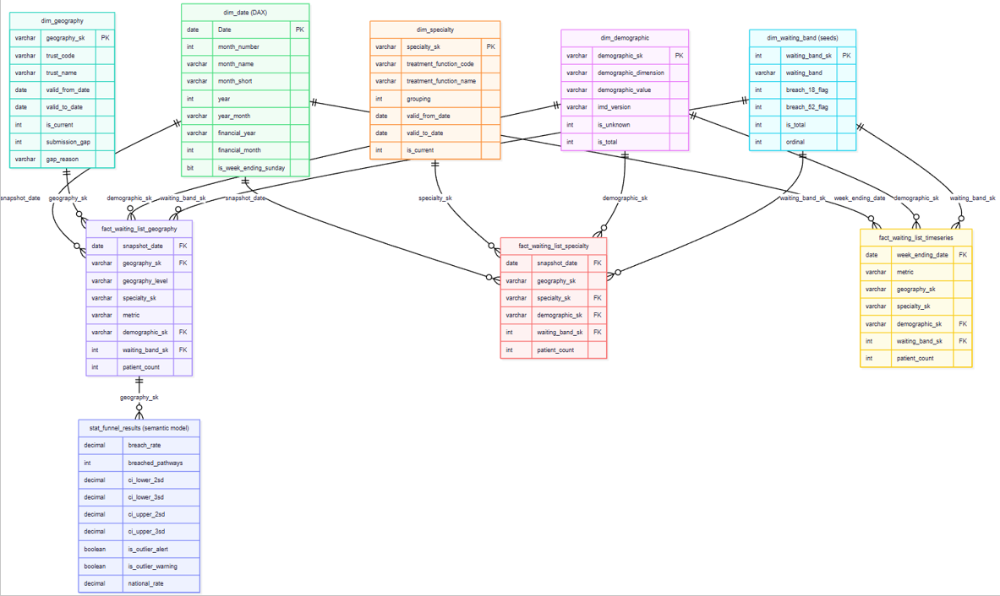

# Physical Data Model
## VBM EquiWait: Demographic Equity in NHS Waiting Lists
### Warehouse: `VBM_EquiWait_WH`

---

## Overview

The analytical model is a single star schema with three fact tables sharing a common set of conformed dimensions. The star schema is deployed to the `marts` schema of `VBM_EquiWait_WH` via dbt, with one exception: `dim_waiting_band` sits in the `seeds` schema and is consumed from there directly.

Beyond the star schema, the Power BI semantic model contains one additional analytical table - `stat_funnel_results` - which supports the funnel plot and outlier detection on the Statistical Tests page. This table is not part of the star schema and is documented separately in Part 3.

---

## Part 1: Warehouse Layer Structure

| Schema | Purpose |
|---|---|
| `landing` | Raw source data as loaded from NHS England CSV files via Fabric Get Data. Not transformed. |
| `intermediate` | Intermediate dbt models. Parsed, deduplicated, standardised. Not for direct consumption. |
| `marts` | Final analytical dimension and fact tables for Power BI consumption. |
| `seeds` | Reference data loaded via dbt seed. Includes `dim_waiting_band` and `trust_name_canonical`. |

---

## Part 2: Star Schema

### Dimension tables

| Table | Schema | Type | Key type | SCD |
|---|---|---|---|---|
| `dim_demographic` | `marts` | Conformed dimension | Surrogate (varchar) | Type 1 |
| `dim_geography` | `marts` | Conformed dimension | Surrogate (varchar) | Type 2 |
| `dim_specialty` | `marts` | Conformed dimension | Surrogate (varchar) | Type 2 |
| `dim_waiting_band` | `seeds` | Reference dimension | Surrogate (int) | Static |
| `dim_date` | Semantic model (DAX) | Date dimension | Date | Static |

### Fact tables

| Table | Schema | Type | Granularity | Source file |
|---|---|---|---|---|
| `fact_waiting_list_geography` | `marts` | Snapshot fact | Organisation * demographic * waiting band * snapshot date | WLMDS Geography |
| `fact_waiting_list_specialty` | `marts` | Snapshot fact | Specialty * demographic * waiting band * snapshot date | WLMDS Specialty |
| `fact_waiting_list_timeseries` | `marts` | Snapshot fact | Week * demographic * waiting band | WLMDS Timeseries |

  

---

## Part 3: Grain Statements

### `fact_waiting_list_geography`

One row per organisation per geography level per metric per demographic category per waiting band per snapshot date.

The Geography file publishes independent rows for each level of the geography hierarchy - England, region, ICB, and trust. These are stored as separate rows identified by `geography_level`. Rows at different geography levels must never be summed together.

### `fact_waiting_list_specialty`

One row per treatment function per metric per demographic category per waiting band per snapshot date, at England level only.

All rows reference the Not Applicable (-1) geography record. No trust or regional breakdown is available in the WLMDS Specialty file.

### `fact_waiting_list_timeseries`

One row per week-ending date per metric per demographic category per waiting band, at England level only, for age and sex dimensions only.

All rows reference the Not Applicable (-1) geography and specialty records. Granularity is weekly rather than monthly.

---

## Part 4: Semantic Model Relationships

All 11 relationships are one-to-many (1:*), single cross-filter direction, active.

| # | From | Key | To | Key |
|---|---|---|---|---|
| 1 | `dim_date` | `Date` | `fact_waiting_list_timeseries` | `week_ending_date` |
| 2 | `dim_date` | `Date` | `fact_waiting_list_geography` | `snapshot_date` |
| 3 | `dim_date` | `Date` | `fact_waiting_list_specialty` | `snapshot_date` |
| 4 | `dim_geography` | `geography_sk` | `fact_waiting_list_geography` | `geography_sk` |
| 5 | `dim_specialty` | `specialty_sk` | `fact_waiting_list_specialty` | `specialty_sk` |
| 6 | `dim_demographic` | `demographic_sk` | `fact_waiting_list_timeseries` | `demographic_sk` |
| 7 | `dim_demographic` | `demographic_sk` | `fact_waiting_list_geography` | `demographic_sk` |
| 8 | `dim_demographic` | `demographic_sk` | `fact_waiting_list_specialty` | `demographic_sk` |
| 9 | `dim_waiting_band` | `waiting_band_sk` | `fact_waiting_list_timeseries` | `waiting_band_sk` |
| 10 | `dim_waiting_band` | `waiting_band_sk` | `fact_waiting_list_geography` | `waiting_band_sk` |
| 11 | `dim_waiting_band` | `waiting_band_sk` | `fact_waiting_list_specialty` | `waiting_band_sk` |

`dim_geography` connects only to `fact_waiting_list_geography` (relationship 4).
`dim_specialty` connects only to `fact_waiting_list_specialty` (relationship 5).

The `geography_sk` and `specialty_sk` columns exist in all three fact tables at the warehouse level but carry Not Applicable surrogate key values (-1) in the tables where no relationship is defined. No semantic model relationship is defined on those columns in the non-connected fact tables.

---

## Part 5: Not Applicable Members

| Dimension | Surrogate key value | Used in |
|---|---|---|
| `dim_geography` | -1 | `fact_waiting_list_specialty` and `fact_waiting_list_timeseries` |
| `dim_specialty` | -1 | `fact_waiting_list_geography` and `fact_waiting_list_timeseries` |

---

## Part 6: Semantic Model Analytical Table

### `stat_funnel_results`

`stat_funnel_results` is a derived analytical table defined in the Power BI semantic model. It is not part of the star schema, is not deployed via dbt, and has no surrogate key or grain in the dimensional modelling sense. It supports the funnel plot and outlier detection visualisation on the Statistical Tests page.

The table takes trust-level breach rate data from `fact_waiting_list_geography` and applies statistical control limit calculations to identify trusts that are outliers relative to the national rate. It is connected to `fact_waiting_list_geography` via an active relationship.

Control limits are calculated using the Wilson score interval method, which is standard practice for NHS statistical process control charts. Limits widen for trusts with smaller waiting lists, reflecting the greater statistical uncertainty in rates derived from smaller denominators.

| Column | Description |
|---|---|
| `breach_rate` | Breach rate for the trust at the selected snapshot. Proportion of patients waiting 18 or more weeks. |
| `breached_pathways` | Count of pathways in breach for the trust at the selected snapshot. |
| `ci_lower_2sd` | Lower control limit at 2 standard deviations. |
| `ci_lower_3sd` | Lower control limit at 3 standard deviations. |
| `ci_upper_2sd` | Upper control limit at 2 standard deviations. Trusts above this are flagged as potential negative outliers. |
| `ci_upper_3sd` | Upper control limit at 3 standard deviations. |
| `is_outlier_alert` | True if the trust breach rate falls outside the 3SD control limits. Corresponds to the red alert threshold in NHS SPC convention. |
| `is_outlier_warning` | True if the trust breach rate falls outside the 2SD limits but within the 3SD limits. Corresponds to the amber warning threshold. |
| `national_rate` | The national average breach rate used as the funnel plot centre line. |

---

## Part 7: Key Design Decisions

### Why dim_geography and dim_specialty do not connect to all fact tables

The three source files have different grains. The Geography file has an organisation axis; the Specialty file has a treatment function axis; the Timeseries file has neither. Connecting `dim_geography` to the specialty or timeseries facts, or `dim_specialty` to the geography or timeseries facts, would be architecturally incorrect. The Not Applicable (-1) members make the absence of those axes explicit. Cross-domain analysis is performed by filtering each fact table independently in DAX and combining results at the measure level.

### Why dim_waiting_band sits in seeds not marts

`dim_waiting_band` is a small, static reference table seeded from a CSV. It has no source data dependency and no transformation logic. Placing it in `seeds` is the correct dbt pattern for this type of reference data. It is consumed directly from the `seeds` schema in the semantic model.

### SCD Type-2 on geography and specialty

`dim_geography` and `dim_specialty` implement SCD Type-2. A new surrogate key is generated whenever attributes change. Historical fact rows retain their original surrogate key. SCD Type-2 is implemented explicitly in dbt models rather than using dbt snapshots, making every version transition visible as explicit SQL.

### SCD Type-1 on demographic with explicit IMD version

`dim_demographic` uses SCD Type-1. The `imd_version` attribute is the exception: deprivation decile assignments depend on which IMD release was in effect, so this is stored explicitly rather than overwritten.

### Integer surrogate key for dim_waiting_band

`dim_waiting_band` uses an integer surrogate key. The dimension is small (five rows), static, and seeded. An integer key is more efficient for joining and sorting than a varchar hash.

### Pre-computed total row handling

Source files contain pre-computed total rows at multiple levels. These are retained and identified by `is_total = 1` in `dim_demographic` and `dim_waiting_band`. All DAX measures filter to component rows only (`is_total = 0`).

### Denominator consistency

All percentage calculations use the demographic sub-total (sum of known, non-total categories) as the denominator, not the overall total. The exclusion gap is surfaced in the dashboard for transparency.

### Snapshot non-additivity

All three fact tables are snapshot facts. They cannot be summed across `snapshot_date` or `week_ending_date` values. All trend analysis compares snapshot values month-on-month.

### Geography hierarchy non-additivity

The Geography file publishes independent aggregate rows for England, each region, each ICB, and each trust. Trust rows do not sum to ICB totals. Analysis at each level filters by `geography_level`.

### Suppressed value handling

WLMDS source files represent values below the disclosure threshold as `*`. The intermediate layer sets these to NULL in the mart layer. NULL values are excluded from all aggregations.

### dim_date in the semantic model

`dim_date` is a DAX calculated table spanning 2021-01-01 to 2030-12-31. Financial year columns follow the NHS April-to-March convention. It connects to `fact_waiting_list_timeseries` via `week_ending_date` and to the monthly fact tables via `snapshot_date`.

### Sheffield Teaching Hospitals submission gap

RHQ is present in `dim_geography` as a normal trust record. Its absence from fact tables from October 2025 onwards is a submission gap due to EPR migration. The `submission_gap` flag is set to 1 and `gap_reason` records the cause.

---

## Part 8: Additivity Rules Summary

| Dimension | Can sum across? | Notes |
|---|---|---|
| `snapshot_date` / `week_ending_date` | No | Snapshot fact tables. Compare snapshots, do not cumulate. |
| `geography_level` | No | Independent aggregate rows at each level. |
| `geography_sk` within a level | Yes | Trusts within an ICB can be summed. |
| `demographic_sk` where `is_total = 0` and `is_unknown = 0` | Yes | Sum known categories to get demographic sub-total. |
| `waiting_band_sk` where `is_total = 0` | Yes | Sum bands to get total patients. |
| `specialty_sk` | Yes | Specialties can be summed to get England total. |

---

*VBM EquiWait - Physical Data Model - May 2026*
*All figures are management information. Not official statistics.*
